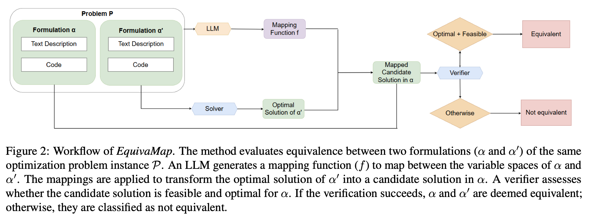

# EquivaMap: Leveraging LLMs for Automatic Equivalence Checking of Optimization Formulations

This repository contains the code for our paper [EquivaMap: Leveraging LLMs for Automatic Equivalence Checking of Optimization Formulations](). Inspired by Karp reductions, in this work we introduce quasi-Karp equivalence, a formal criterion for determining when two optimization formulations are equivalent based on the existence of a mapping between their decision variables. We propose EquivaMap, a framework that leverages large language models to automatically discover such mappings, enabling scalable and reliable equivalence verification. To evaluate our approach, we construct the first open-source dataset of equivalent optimization formulations, generated by applying transformations such as adding slack variables or valid inequalities to existing formulations. 



## Step 0: Setup

To run the code, you need to install the following packages.
```
pip install openai
pip install subprocess
pip install glob
pip install json
pip install gurobipy
```

## Step 1: Data Preparation 

We construct [EquivaFormulation](https://huggingface.co/datasets/humainlab/EquivaFormulation) based on the [NLP4LP](https://huggingface.co/datasets/udell-lab/NLP4LP). The variations are labeled with different suffixes, which can be found on the Huggingface page.

## Step 2: Mapping Finding

The implementation of EquivaMap can be found in the `evaluation/` folder.

To find the mapping between two formulations, you need to substitute your Openai API-key into the `mapping_finder_.py` file,
```
# Set your OpenAI API key
client = OpenAI(api_key='your-api-key')
```

and change the directory
```
# Base directory containing all the problems
base_dir = '/Users/stevenzhai/Desktop/MILP_data/sample-data-easy/'
```

into your local directory. 

## Step 3: Evaluation

